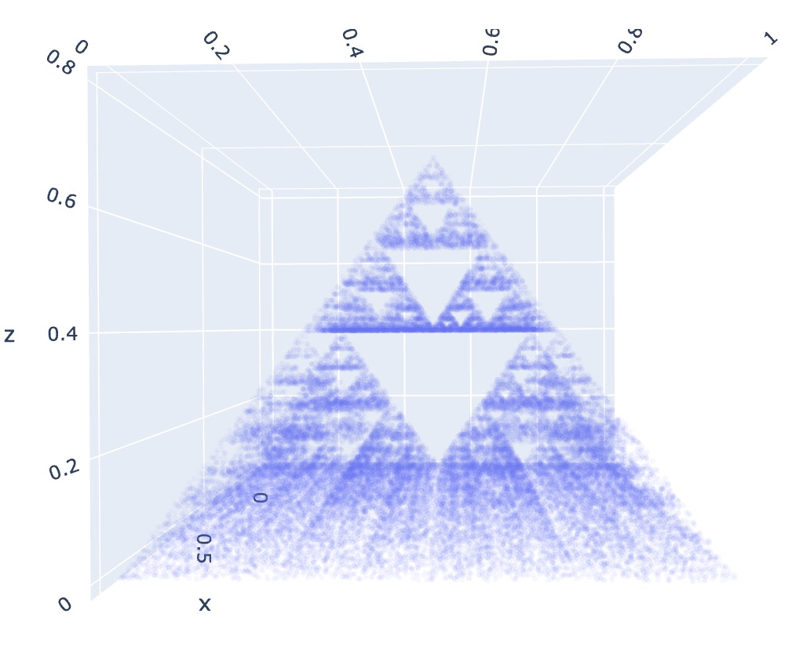

# Fractal Flip

A series of fractals.

## 2D

> [2d-fractals.ipynb](./2d-fractals.ipynb)

See the code in the notebook.

|3 points (2D)|5 points (2D)|
|-|-|
|||

## 3D

> [3d-fractals.ipynb](./3d-fractals.ipynb)

See the code in the notebook.

|4 points (3D)|8 points (3D)|
|-|-|
|||
